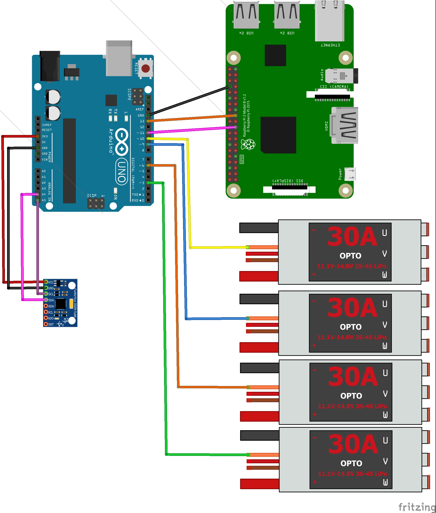

# drone-with-facial-detection

## Overview

This repository contains the code to create a drone that can detect and follow a human face. I decided to use a Pi for facial detection and an Arduino for a flight controller. The Raspberry Pi uses OpenCV to detect faces and sends the location of the face in the frame to the Arduino via SPI, which moves the drone so as to position the face in the middle of the frame.

## Materials

- Arduino Uno
- Arduino Sensor Shield (Makes wiring less of a nightmare)
- Raspberry Pi 3 Model B (OpenCV installed with extra modules)
- Quadcopter 450 Frame
- MPU6050 Accelerometer/Gyroscope
- Power Distribution Board
- SimonK 30A ESCs
- EMAX 2213 935KV Motors
- 5000mah 3s Lithium-Polymer battery
- 1045 Props
- Raspberry Pi Camera v2

## Circuit Diagram

